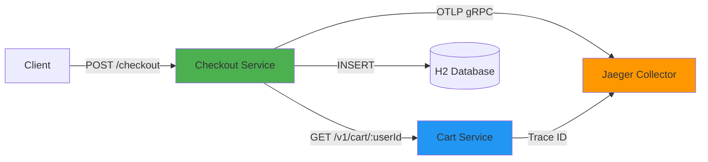

# Poly-Shop Checkout Service

**Production-ready payment simulation and currency conversion microservice** built with Java 21, Spring Boot 3.x, and OpenTelemetry auto-instrumentation.

Part of the [Poly-Shop Microservices Suite](../README.md) - designed for **Kubernetes administration practice** with realistic behavioral testing capabilities.

---

## 🎯 Features

### Core Functionality
- ✅ **Payment Processing** - Simulate checkout with configurable success rates (80% default)
- ✅ **Currency Conversion** - Multi-currency support (USD, CAD, EUR, GBP)
- ✅ **Cart Verification** - Integrates with cart-service for item validation
- ✅ **Transaction History** - H2 in-memory database with JPA persistence

### Observability & Tracing
- 📊 **OpenTelemetry Auto-Instrumentation** - Zero-code distributed tracing via Java Agent
- 🔍 **W3C Trace Context Propagation** - Automatic trace ID propagation to downstream services
- 📈 **Spring Boot Actuator** - Health, metrics, and liveness/readiness probes for K8s

### Kubernetes Engineering (Week 8 & 10)
- ⏱️ **Slow Startup Simulation** - 15-second warmup to test `startupProbes`
- 💾 **Memory Load Testing** - Endpoints to simulate OOMKill scenarios
- 🔧 **JVM Tuning** - Heap sizes (-Xms512m/-Xmx768m) close to container limits
- 🏥 **Health Probes** - `/actuator/health/liveness` and `/actuator/health/readiness`

### Project Structure

```
checkout-service/
├── pom.xml                 # Maven dependencies
├── Dockerfile              # Multi-stage build (Maven + JRE)
├── src/
│   ├── main/
│   │   ├── java/com/polyshop/checkout/
│   │   │   ├── CheckoutServiceApplication.java # Entry point
│   │   │   ├── controller/ # REST controllers
│   │   │   ├── service/    # Business logic (Checkout, Currency)
│   │   │   ├── model/      # DTOs and JPA Entities
│   │   │   └── repository/ # Spring Data JPA repositories
│   │   └── resources/
│   │       └── application.yml # Configuration
│   └── test/               # JUnit 5 tests
└── k6/                     # Load testing scripts
```

---

## 📦 Quick Start

### Prerequisites
- Java 21 (or Docker for containerized builds)
- Maven 3.9+
- Docker & Docker Compose (for full stack)

### Run Standalone (Development)

```bash
cd checkout-service

# Build and test
mvn clean install

# Run application
mvn spring-boot:run

# Access service
curl http://localhost:8085/
```

### Run with Docker Compose (Recommended)

```bash
cd d:\code\poly-app

# Build and start all services
docker-compose up --build -d

# Wait for startup (checkout-service has 15s delay)
docker-compose logs -f checkout-service

# Verify health
curl http://localhost:8085/actuator/health
```

**Expected Startup Flow:**
```
⏳ Simulating slow startup - sleeping for 15 seconds...
✅ Startup delay complete - application is now initializing
✅ Checkout Service started successfully!
📊 OpenTelemetry agent is instrumenting HTTP and DB calls
```

---

## 🚀 API Endpoints

### Payment Processing

#### POST /checkout
Process a checkout request by verifying cart and simulating payment.

**Request:**
```bash
curl -X POST http://localhost:8085/checkout \
  -H "Content-Type: application/json" \
  -d '{
    "userId": "user-123",
    "cartItems": [
      {"productId": "1", "quantity": 2},
      {"productId": "5", "quantity": 1}
    ]
  }'
```

**Response (Success):**
```json
{
  "transaction_id": "7f8e3a1b-9c4d-4e2a-b3f1-5d8c9e7a2b4f",
  "status": "SUCCESS",
  "message": "Payment processed successfully",
  "user_id": "user-123",
  "total_items": 2,
  "trace_id": "4bf92f3577b34da6a3ce929d0e0e4736"
}
```

**Status Codes:**
- `200` - Payment successful
- `400` - Cart not found or empty
- `500` - Payment failed or internal error

---

### Currency Conversion

#### GET /currency/convert
Convert amounts between supported currencies.

**Request:**
```bash
curl "http://localhost:8085/currency/convert?amount=100&from=USD&to=CAD"
```

**Response:**
```json
{
  "original_amount": 100.00,
  "original_currency": "USD",
  "converted_amount": 135.00,
  "target_currency": "CAD",
  "exchange_rate": 1.35
}
```

**Supported Currencies:** USD, CAD, EUR, GBP

#### GET /currency/rates
Get all exchange rates.

```bash
curl http://localhost:8085/currency/rates
```

---

### Testing & Monitoring

#### POST /admin/memory-load
Simulate high memory usage for testing OOMKill scenarios.

⚠️ **WARNING:** Only for testing! Can crash the container.

```bash
# Allocate 600MB (safe with 768MB max heap)
curl -X POST "http://localhost:8085/admin/memory-load?sizeMB=600"

# Allocate 800MB (exceeds 768MB limit → OOMKill)
curl -X POST "http://localhost:8085/admin/memory-load?sizeMB=800"
```

**Response:**
```json
{
  "allocated_mb": 600,
  "used_after_mb": 650,
  "max_heap_mb": 768,
  "usage_percent": 84.6,
  "warning": "Memory allocation successful. Monitor container for OOMKill!"
}
```

#### GET /admin/memory-stats
Get current JVM memory statistics.

```bash
curl http://localhost:8085/admin/memory-stats
```

#### POST /admin/memory-clear
Clear allocated memory and trigger GC.

```bash
curl -X POST http://localhost:8085/admin/memory-clear
```

---

### Health & Actuator

#### GET /actuator/health
Overall health status.

#### GET /actuator/health/liveness
Kubernetes liveness probe endpoint.

#### GET /actuator/health/readiness
Kubernetes readiness probe endpoint.

```bash
curl http://localhost:8085/actuator/health/liveness
curl http://localhost:8085/actuator/health/readiness
```

---

## 🔬 OpenTelemetry Instrumentation

### How It Works (Automatic Tracing)

The checkout-service uses the **OpenTelemetry Java Agent** for **byte-code instrumentation**:

```
JVM Startup → Agent Loads → Classes Transformed → Tracing Injected
```

**What Gets Instrumented Automatically:**
1. **HTTP Servers** - Spring MVC controllers (POST /checkout)
2. **HTTP Clients** - RestTemplate calls to cart-service
3. **Databases** - JPA/Hibernate queries to H2
4. **Logging** - SLF4J log correlation with trace IDs

**Configuration (Dockerfile):**
```bash
# Download OTel Java Agent v2.2.0
OTEL_AGENT_VERSION=2.2.0
wget https://github.com/open-telemetry/opentelemetry-java-instrumentation/releases/download/v${OTEL_AGENT_VERSION}/opentelemetry-javaagent.jar

# Attach to JVM via JAVA_TOOL_OPTIONS
ENV JAVA_TOOL_OPTIONS="-javaagent:/app/opentelemetry-javaagent.jar"

# Set OTLP exporter endpoint (Jaeger)
ENV OTEL_EXPORTER_OTLP_ENDPOINT="http://jaeger:4317"
ENV OTEL_SERVICE_NAME="checkout-service"
```

**Distributed Trace Example:**

```
POST /checkout (checkout-service)
├─ GET http://cart-service:8080/v1/cart/user123 → [trace context injected]
│  └─ cart-service receives same trace_id
├─ INSERT INTO transactions (...)
└─ Response with trace_id
```

**View Traces:**
1. Open Jaeger UI: http://localhost:16686
2. Select service: `checkout-service`
3. Click "Find Traces"

You'll see spans showing:
- HTTP request duration
- RestTemplate call to cart-service with propagated trace ID
- Database INSERT operation
- Total checkout processing time

---

## 🏥 Kubernetes Health Probes

### Probe Configuration

The service implements all three K8s probe types:

#### 1. Startup Probe (Critical!)
Handles the 15-second initialization delay.

```yaml
startupProbe:
  httpGet:
    path: /actuator/health/readiness
    port: 8085
  initialDelaySeconds: 5
  periodSeconds: 5
  failureThreshold: 6  # Allow up to 30s for startup (5 + 5*6)
```

**Why Needed:**
- Without startupProbe, liveness/readiness probes start immediately
- Service takes 15s to start → probes fail → CrashLoopBackOff
- startupProbe delays liveness/readiness until app is ready

#### 2. Liveness Probe
Checks if app is alive (not deadlocked/frozen).

```yaml
livenessProbe:
  httpGet:
    path: /actuator/health/liveness
    port: 8085
  periodSeconds: 10
  failureThreshold: 3
```

**Behavior:**
- Runs after startupProbe succeeds
- 3 consecutive failures → Container restart

#### 3. Readiness Probe
Checks if app can serve traffic.

```yaml
readinessProbe:
  httpGet:
    path: /actuator/health/readiness
    port: 8085
  periodSeconds: 10
  failureThreshold: 3
```

**Behavior:**
- Runs after startupProbe succeeds
- Failures → Pod removed from Service load balancer

### Preventing CrashLoopBackOff

**Common Mistake:**
```yaml
# ❌ BAD: No startupProbe, short liveness delay
livenessProbe:
  httpGet:
    path: /actuator/health/liveness
  initialDelaySeconds: 10  # App takes 15s to start!
  periodSeconds: 5
  failureThreshold: 3
# Result: Probe fails at 10s → restart → infinite loop
```

**Correct Configuration:**
```yaml
# ✅ GOOD: Use startupProbe for slow startups
startupProbe:
  httpGet:
    path: /actuator/health/readiness
  initialDelaySeconds: 5
  periodSeconds: 5
  failureThreshold: 6  # 30s total
livenessProbe:
  httpGet:
    path: /actuator/health/liveness
  periodSeconds: 10
```

---

## 💾 JVM Memory Management

### Heap Configuration

**Current Settings (Dockerfile):**
```bash
ENV JAVA_OPTS="-Xms512m -Xmx768m"
```

- `-Xms512m` - Initial heap size (starts with 512MB allocated)
- `-Xmx768m` - Maximum heap size (can't exceed 768MB)

**Container Resource Limits:**
```yaml
# Recommended K8s limits
resources:
  limits:
    memory: 1Gi   # 768MB heap + ~256MB non-heap
  requests:
    memory: 768Mi
```

### Memory Breakdown

**Total Container Memory = Heap + Non-Heap**

| Component | Size | Purpose |
|-----------|------|---------|
| Heap (-Xmx) | 768MB | Objects, arrays, collections |
| Metaspace | ~128MB | Class metadata, bytecode |
| Thread Stacks | ~50MB | Thread local variables |
| Code Cache | ~50MB | JIT compiled code |
| Native Memory | ~30MB | NIO buffers, JNI |
| **Total** | **~1GB** | **Container limit** |

### Monitoring JVM Inside Container

**Check JVM settings:**
```bash
docker exec poly-shop-checkout-service java -XshowSettings:vm -version
```

**Monitor heap usage:**
```bash
docker stats poly-shop-checkout-service
```

**JVM memory breakdown:**
```bash
docker exec poly-shop-checkout-service jcmd 1 VM.native_memory summary
```

**Trigger heap dump on OOM:**
```bash
# Heap dump saved to /tmp/heapdump.hprof
docker exec poly-shop-checkout-service ls -lh /tmp/
docker cp poly-shop-checkout-service:/tmp/heapdump.hprof ./
```

---

## 🧪 Testing

### Unit Tests (JUnit 5 + Mockito)

```bash
cd checkout-service

# Run all tests
mvn test

# Run specific test class
mvn test -Dtest=CheckoutServiceTest

# Generate coverage report
mvn jacoco:report

# View coverage (target 85%)
open target/site/jacoco/index.html
```

**Test Coverage:**
- `CheckoutServiceTest` - Business logic with mocked RestTemplate
- `CurrencyServiceTest` - Currency conversion with parameterized tests
- `CheckoutControllerTest` - HTTP endpoints with MockMvc

**Expected Output:**
```
Tests run: 18, Failures: 0, Errors: 0, Skipped: 0
Coverage: 87% (Target: 85%)
```

### Integration Tests (Spring Boot Test)

```bash
mvn verify
```

Tests full Spring context with:
- Controller → Service → Repository flow
- JSON serialization/deserialization
- HTTP status code validation

### Load Testing (k6)

```bash
cd checkout-service

# Install k6 (if not installed)
# Windows: choco install k6
# Mac: brew install k6

# Run load test
k6 run k6/checkout-flow.js

# Custom config
k6 run --vus 20 --duration 60s k6/checkout-flow.js
```

**Test Scenarios:**
- 10 VUs for 30 seconds
- POST /checkout with varying user IDs
- GET /currency/convert
- GET /admin/memory-stats

**Success Criteria:**
- ✅ p95 response time < 500ms
- ✅ Checkout success rate > 70% (80% with config)
- ✅ HTTP failure rate < 10%

---

## 🐳 Docker Configuration

### Build Image

```bash
cd checkout-service

# Build multi-stage Docker image
docker build -t poly-shop-checkout-service:latest .

# Check image size
docker images poly-shop-checkout-service
```

**Image Layers:**
1. Maven build stage (eclipse-temurin:21 + Maven)
2. Runtime stage (eclipse-temurin:21-jre-alpine)
3. OpenTelemetry agent download (~3MB)
4. Application JAR (~50MB)

**Total Size:** ~250MB

### Environment Variables

| Variable | Default | Description |
|----------|---------|-------------|
| `CART_SERVICE_URL` | `http://cart-service:8080` | Cart service endpoint |
| `OTEL_EXPORTER_OTLP_ENDPOINT` | `http://jaeger:4317` | Where to send traces |
| `OTEL_SERVICE_NAME` | `checkout-service` | Service name in traces |
| `STARTUP_DELAY_SECONDS` | `15` | Startup delay for probe testing |
| `JAVA_OPTS` | `-Xms512m -Xmx768m` | JVM heap configuration |

---

## 📊 Architecture

### Service Dependencies



### Trace Flow

```
1. Client → POST /checkout [trace_id: abc123]
   ↓
2. checkout-service creates root span
   ↓
3. RestTemplate → GET cart-service [traceparent: 00-abc123-...]
   ↓
4. cart-service continues trace (same trace_id)
   ↓
5. Both services export spans to Jaeger
   ↓
6. Jaeger UI shows complete trace with 2 services
```

---

## 🔧 Configuration

### application.yml

```yaml
server:
  port: 8085

spring:
  datasource:
    url: jdbc:h2:mem:checkoutdb
  jpa:
    hibernate:
      ddl-auto: create-drop

management:
  endpoints:
    web:
      exposure:
        include: health,info,metrics
  health:
    livenessState:
      enabled: true
    readinessState:
      enabled: true

checkout:
  cart-service-url: ${CART_SERVICE_URL:http://cart-service:8080}
  payment:
    success-rate: 0.8
    processing-time-ms: 200
  startup-delay-seconds: 15

currency:
  rates:
    USD_TO_CAD: 1.35
    USD_TO_EUR: 0.92
    # ... more rates
```

---

## 🎓 Learning Objectives (Week 8 & 10)

### What You'll Learn

#### Week 8: Kubernetes Fundamentals
1. **Startup Probes** - Why they prevent CrashLoopBackOff for slow-starting apps
2. **Resource Limits** - How JVM heap relates to container memory
3. **OOMKill** - Testing real memory exhaustion scenarios
4. **Health Checks** - Difference between liveness and readiness

#### Week 10: Advanced Topics
1. **Distributed Tracing** - Following requests across microservices
2. **JVM Tuning** - Heap sizing for containerized Java apps
3. **Horizontal Pod Autoscaling** - Memory-based scaling triggers
4. **Service Mesh** - Trace propagation with sidecars (Istio/Linkerd)

---

## 🚨 Troubleshooting

### Service Won't Start

**Issue:** Container exits immediately

**Solutions:**
1. Check startup logs: `docker-compose logs checkout-service`
2. Verify Java 21 available: `java -version`
3. Check port 8085 not in use: `netstat -an | findstr "8085"`
4. Increase Docker memory to 2GB minimum

### CrashLoopBackOff in Kubernetes

**Issue:** Pod restarts repeatedly

**Solutions:**
1. Check probe timing:
   ```bash
   kubectl describe pod checkout-service-xxx
   ```
2. Verify startupProbe `failureThreshold * periodSeconds > 15s`
3. Watch startup logs:
   ```bash
   kubectl logs -f checkout-service-xxx
   ```

### Traces Not Appearing in Jaeger

**Issue:** No traces in Jaeger UI

**Solutions:**
1. Verify Jaeger running: `docker-compose ps jaeger`
2. Check OTLP endpoint: Should be `jaeger:4317` (gRPC)
3. Generate traffic: `curl -X POST http://localhost:8085/checkout ...`
4. Check agent logs in container startup

### OOMKilled

**Issue:** Container killed by K8s

**Expected Behavior:**
This is intentional when testing memory limits!

**Verify:**
```bash
kubectl describe pod checkout-service-xxx
# Should show: Reason: OOMKilled
```

**Fix for production:**
- Increase `-Xmx` heap size
- Increase container memory limit
- Profile app to reduce memory usage

---

## 📚 Related Documentation

- [Main Project README](../README.md) - Full Poly-Shop architecture
- [Cart Service](../cart-service/README.md) - Shopping cart API
- [Product Service](../product-service/README.md) - Product catalog
- [OpenTelemetry Java Docs](https://opentelemetry.io/docs/instrumentation/java/automatic/)
- [Spring Boot Actuator](https://docs.spring.io/spring-boot/docs/current/reference/html/actuator.html)
- [Kubernetes Probes](https://kubernetes.io/docs/tasks/configure-pod-container/configure-liveness-readiness-startup-probes/)

---

## 📄 License

Part of the Poly-Shop educational project. MIT License.

**Version:** 1.0.0  
**Java:** 21  
**Spring Boot:** 3.2.2  
**OpenTelemetry Agent:** 2.2.0
